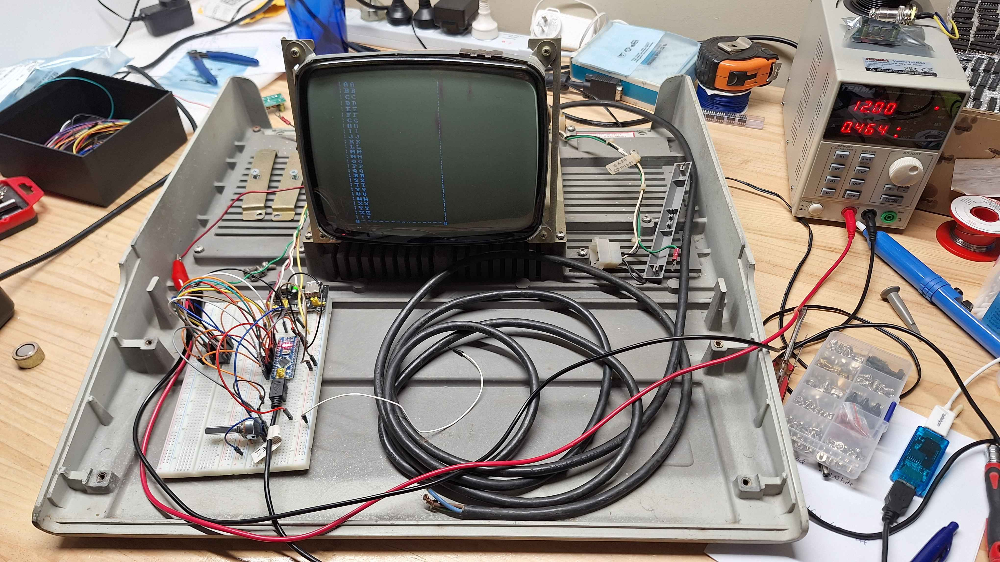
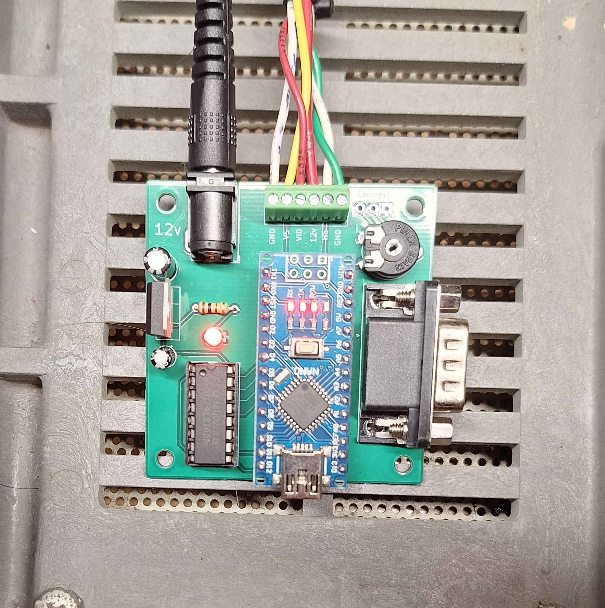

# QDM-9-CRT NANO Driver #

This repository contains the PCB and software to build a simple TTL video driver using an Arduino Nano
It also has a Gamepad plug. 

## Building ##
 1. [Install AVR 8-Bit Toolchain](https://www.microchip.com/en-us/tools-resources/develop/microchip-studio/gcc-compilers)
 2. make && make upload 

## PCB BOM ##

| Quantity | Part | Link |
|:---:|:---:|:---:|
| 1 | 1K Resistor |  |
| 1 | Barrel Jack | https://www.digikey.co.nz/en/products/detail/same-sky-formerly-cui-devices/PJ-037A/1644545 |
| 1 | 74LS165N |  |
| 1 | POT | https://www.digikey.co.nz/en/products/detail/amphenol-piher-sensing-systems/PT10LV10-222A2020-PM-S/9555921 |
| 1 | Screw Terminal 6 POS | https://www.aliexpress.com/item/1005001677869988.html? |
| 1 | LM7805 | https://www.digikey.co.nz/en/products/detail/stmicroelectronics/L7805ABV/634711 |
| 1 | 0.1uF |  |
| 1 | 0.22uF |  |
| 1 | 3mm LED RED |  |
| 1 | Nano |  |
| 1 | DB-9 Female | https://www.digikey.co.nz/en/products/detail/assmann-wsw-components/A-DS-09-A-KG-T2S/1241804 |
| 1 | Game Pad |  https://www.aliexpress.com/item/1005005697321299.html |